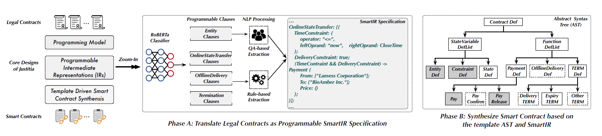

# Justitia

## Introduction

The Pandemic has fundamentally shaped many aspects ofour lives. One significant example is the ever-growing digi-tal transformation for virtually every type of business, suchas online courses, online conferencing, online medical andpharmaceutical systems, remote work forces, and so on.
Similarly, the legal sector is experiencing online transformation. To enable profound digital
transformation of legal contract, Justitia is the first system that synthesizes blockchain-executable
smart contracts that honor the semantics of legally binding agreements.

## Requirements
<ol>
<li>Python 3.7</li>
<li>Node v12.18.1</li>
<li>npm v6.14.5</li>
</ol>

## Input
Legal contract

## Output
Smart contract which reflects the semantic requirements

## Setup
1. download and unzip [roberta-classification.zip](https://drive.google.com/file/d/1s8vbKgDeQ8NN4IpS3oPX87BJgWMJY1-w/view?usp=sharing), and assign the path to the variable CLASSIFIER_PATH in the file project_global_value.
2. download and unzip [trained-qa.zip](https://drive.google.com/file/d/1cU7zgLDHAqW2sgbBj3YXcdmikLKG3oHQ/view?usp=sharing), and assign the path to the variable TRAINED_QA_MODEL_PATH in the file project_global_value.
3. install the required packages and StanfordCorenlp pipeline

## How to run
First, users should generate the smartIR. To generate smartIR, users should execute
pipline_for_contract with two input parameters: legal contract location and output location.
After this execution, the res folder contains the four types programmable clauses and smartIR.

    python3 pipline_for_contract.py contract_path output_path

After the smartIR for a legal contract is generated, it is ready to synthesize the corresponding target smart contract. The code for synthesis process are placed under folder `src/synthesis`. Please install dependencies first:

```bash
cd src/synthesis
npm install
```

A typical example showing how to pipe the synthesis process is `src/synthesis/test/test_template/batch_eval.js`, which actually generates the test dataset for us. You can run it with:

```bash
cd src/synthesis/test/test_template/
node batch_eval.js
```

